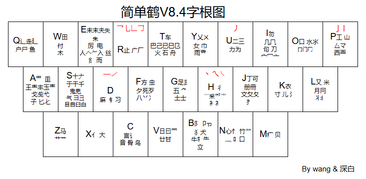

# Rime 输入法 「简单鹤」双拼辅助码方案
Rime 输入法配置方案，小鹤双拼+**简单鹤**乱序字根辅助方案+修改配置后的**全拼**（可加辅码）与 **虎码**（字词合并）方案

---

## [简单鹤](https://flauver.github.io/jdh/)介绍

####  乱序字根

使用官网 [字根记忆程序](https://flauver.github.io/jdh/gen.html)学习字根，最快能在一个小时内掌握简单鹤的字根

#### 单字低重

让你轻松盲打

#### 字词不重

简单鹤采用了极端的字词避重方式，在算码的时候尽量让更多的字处在三码位，剩下的四码单字则全部放在次选，好让四码首选永远可以畅快打词。

#### 没有小字

没有小字，拆分直观，使得简单鹤在打生字时也能快速反应

#### 简单鹤拆分规则 

笔顺优先（无笔画粘连的口可无视笔顺），首末取大，相交也拆，插隔也取，字根字重复，禾取丿八 例如：由 = 日 + 丨， 平 = 一 + 十， 虫 = 虫 + 虫

#### [无理码](other/简单鹤无理码及简词说明.txt) （以下的「我」代指码表作者「简单」）

如何看待无理？我认为，无理应该安排超高频的简词，这样它在哪里都无所谓的。
你问我忘了怎么办？
忘了就说明重复次数不够，说明它对你没那么高频，那忘了就忘了吧。完美逻辑闭环。

1. qo和xo，是qx和xq的飞键，仅这两个飞键我强制规范用户记住，因为原按键过于奇葩。故相关的简词也对应调整，但也做了容错。

2. 有不少末尾含“一”的简词，放在了e上。现统计如下：
we 唯一 万一
de 第一
le 了一 另一
ve 之一
me 每一

3. “一”开头的量词，以“e”开始。现统计如下：
eq 一起 一切
ew 一位
et 一天
ey 一眼
eu 一声 一生
ei 一场
ep 一片
es 一丝
ed 一旦
ef 一份 一副
eg 一股 一根
eh 一行
ej 一件 一句
ek 一块
ev 一种 一阵 一只
eb 一般 一边 一半
en 一年
em 一名

这里有一些超高频的简词，放在了y开头的，这些最好是要掌握起来，实际上讲，我个人除了eq外，几乎不打e开头的简词。
另外，“一”开头的量词，除了e引导的简外，最好是拆开打。不过也有专属的简码，似乎上百个，如eitd一台，等等。

yy 一样
yd 一定 一点
yg 一个
yx 一下 一些
yc 一次
yv 一直

这些词不要求掌握，真正打字时，很可能拆成了“一”加量词的形式，随用随熟即可。

强调一下，有关于“一”的词，只有2字词有e的设定，其他长度的没有。几和百是同理。

4. 我随便加的，超高频，肯定忘不了就是了：
yp 一个人 有时候 一会儿
dp 到时候 的时候（duh打三简也很好，几乎并击秒出，看个人习惯，主要是为了对应x时候）
vp 这时候
np 那时候
jf 不知道
uo 时间 世界 说：“

5. s和sh的无理：
js 就是
bs 不是
ms 马上 没事 模式
ls 脸上
sj 手机
sb 上班
sm 什么 上面 生命
ss 试试
sh 说话 时候 似乎
sy 使用

6. c和ch的无理：
jc 经常

7. z和zh的无理：
zy 重要

8. 有关“实”的无理：
sj 实际
sl 实力
sx 实现
xs 现实

#### 无理单字

o 也
p 得 道 道：“
s 时
f 能
je 及（唯一的一个二码，忘了也无所谓，本来也在四码）
jo 几（以及相关词）
be 百（以及相关词）

#### [简词说明](other/简单鹤无理码及简词说明.txt) （以下的「我」代指码表作者「简单」）

1. 简词未必会铺满，在长期打字中，我感觉用不到的，我就不加了。
2. 当词频类似，优先加手感差的，其次考虑简词好对应的。
3. 所有简词均做了全码，简单鹤词频不搞出简让全，所以不要求掌握记忆，记住哪些打哪些，锦上添花。
4. 简词的排序，与词频无关，只与对应有关。我们最终是为了打字的体验，以及记忆的易维持，要懂得思考背后的安排。词频是没有意义的。（如：爸 妈 哥 姐 弟 妹 统一在次选）
5. 三简不用管，这是为了手机上输入方便点，平时挂接打全码才是最舒适的体验。或者只打语气词或连接词这种，如“了一个”“比如说”，随用随熟。（Github上的方案有区别 3码三字简词有稍微手动纠正错音和排序，因为本人在rime使用中会忍不住也想打3简词）

#### 容错（[详细说明](other/简单鹤容错统计截至V8.4.0.txt))

简单鹤有贴心的容错，有时虽然你拆字的字根和推荐用法不一样，但你以为的拆法也许是大家以为的，所以当一个字，你发现有两种打方式打出，不用怀疑是不是错了。

## 配置介绍

- 简体 | 全拼（可加辅码） | 双拼（可加辅码）|音形（自动上屏）|虎码（字词合并）

-  主要功能

  - 轻量的英文输入，支持中英混输（取自 [雾凇拼音](https://github.com/iDvel/rime-ice)）
  
  - [优化英文输入体验](https://dvel.me/posts/make-rime-en-better/)
  
  - 拆字反查  <kbd>oiz</kbd> + 拼音  (默认为小鹤双拼 支持改为**全拼**或**自然码双拼**)（取自 [雾凇拼音](https://github.com/iDvel/rime-ice)）
  
  - 统配反查键 <kbd>\`</kbd> 横排数字键1左边 ，（支持改为**全拼**或**自然码双拼**）
    <kbd>\`</kbd> + 小鹤双拼 （此配置下所有方案均可以此形式反查，但「虎码」是临时双拼）
    小鹤双拼 + <kbd>\`</kbd>（**仅限**选择「简单鹤」方案以此形式反查）
    小鹤双拼+ <kbd>\`</kbd> + 形码 （形码默认是以「自然码字根」支持改为 简单鹤/自然码/虎码/官鹤）
    
  - 虎码输入 <kbd>ohm</kbd> + 虎码（本人再使用简单鹤前为虎码用户，所以有带上这个功能）
  
  - 雾凇方案下整理的 Emoji （取自 [雾凇拼音](https://github.com/iDvel/rime-ice)）
  
  - 以词定字（首字：<kbd>Shift</kbd> + <kbd>1</kbd>，末字：<kbd>Shift</kbd> + <kbd>2</kbd>）
  
  - 长词优先（**仅限**选择「朙月拼音」方案下） （取自 [雾凇拼音](https://github.com/iDvel/rime-ice)）
  
  - Unicode（<kbd>U</kbd>+Unicode 码位）（取自 [雾凇拼音](https://github.com/iDvel/rime-ice)）
  
  - 数字、人民币大写、简易计算器（<kbd>=</kbd> + 数字 或 算式）（取自 [空山五笔](https://github.com/mrshiqiqi/rime-wubi)）
  
  - 日期、时间、星期、农历（<kbd>/</kbd>+wd、wt、wk、nl 农历可加数字输入。<kbd>o</kbd> 加对应的简拼也可以，如orq、oxq、osj、onl、）（取自 [飞鹤快拼](https://github.com/boomker/rime-fast-xhup)）
  
  - Emoji 表情符号排序后置 （详见配置 `config_base.yaml/emoji_reduce` 节点）（取自 [飞鹤快拼](https://github.com/boomker/rime-fast-xhup)）
  
  - 置顶候选项， 将希望排序靠前的字词 按下<kbd>Ctrl</kbd>+<kbd>T</kbd>，再按一下取消指定。数据保存在 `Rime\lua\jdh\pin_word_record.lua` 或 `Rime\lua\tiger\pin_word_record.lua` **仅限 「简单鹤・字词」和「虎码」两个方案下使用**（取自 [飞鹤快拼](https://github.com/boomker/rime-fast-xhup)）
  
  - 隐藏候选词或降低排序，将不希望出现在候选中的词组，按下<kbd>Ctrl</kbd>+<kbd>X</kbd> 隐藏，按下<kbd>Ctrl</kbd>+<kbd>J</kbd> 降低排序，数据保存在 `Rime\lua\jdh\cold_word_records\hide_words.lua(隐藏组词)、reduce_freq_words.lua(降频词组)` 虎码方案下储存路径同理。**仅限 「简单鹤」「简单鹤・字词」和「虎码」三个方案下使用**（取自 [飞鹤快拼](https://github.com/boomker/rime-fast-xhup)）
    在使用该方案时，如果不满意排序的候选，**建议**以此功能来修改，这样独立于码表，方便在后续更新方案时，不被覆盖掉个人的使用习惯
  
  - 字集切换开关（区分常用单字和全字集）（取自 [虎码输入方案](https://github.com/ywxt/rime-huma?tab=readme-ov-file)）
  
  - 虎码拆字3重注释（已被本人修改为3.5重，0.5重为仅显示拼音，作为其他方案的拼音滤镜）（取自 [虎码输入方案](https://github.com/ywxt/rime-huma?tab=readme-ov-file)）
  
  - 字词候选嵌入输入栏开关（取自 [宇浩输入方案](https://github.com/forFudan/yuhao)）
  
  - 标点快符自动上屏 <kbd>；</kbd>+ 字母 比如输入 `;a` 自动上屏 `！`（详见配置 `custom_phrase/quick_symbol_phrase.txt` 文件）
  
  - <kbd>/FJ</kbd> 前缀: 用于输入常用短语(邮箱/手机号/银行卡号/收件地址); 和打开常用网站网址, 本地文件路径; 执行常见指令(开关系统设置) 等等, 可自行在`Rime\lua\launcher_config.lua` 里添加（取自 [飞鹤快拼](https://github.com/boomker/rime-fast-xhup)）
  
  - <kbd>/JK</kbd> 前缀: 用于快速启动或切换程序 可自行在`Rime\lua\launcher_config.lua` （取自 [飞鹤快拼](https://github.com/boomker/rime-fast-xhup)）
  
  - 根据是否在用户词典，在结尾加上一个标识（取自 [白霜拼音](https://github.com/gaboolic/rime-frost)）
    上屏过的候选词 末尾带有「✩」
  
    用户短语词库中的候选词（custom_phrase）末尾带有「❖」
  
    整句连拼时（输入词库中未有的词句）末尾带有「∞」
  
- **简单鹤方案下的特殊介绍**（上述的主要功能全都包含，以下为专有） 

  - 固词动词切换开关 （简单鹤词库候选末尾会带一个「⌃」符号区分） （取自 [魔然输入方案](https://github.com/ksqsf/rime-moran)）
    **固词模式**下 输入的前4码 为简单鹤码表词库，固定排列在最前面，拼音词库作为补充，当简单鹤空码，排序靠前
    **动词模式**下 只有输入的前3码 为简单鹤码表词库，固定排序在最前面，拼音词库作为补充，4码排序靠前，而且会随着候选上屏情况，调节词序（此模式下 简单鹤的4码单字不会优先靠前）
    习惯音形，字词输入节奏的用户，建议<kbd>Ctrl</kbd>+<kbd>~</kbd> 切换成 **固词模式**，四码词序和单字确定性更强

  - 简码提示 （取自 [魔然输入方案](https://github.com/ksqsf/rime-moran)）
    如果以完整编码在输入2字词 3字词 4字词时，和在候选提示该词的简码

    如果希望单字也提示简码，可自行在`double_pinyin_flypy.custom.yaml/moran/quick_code_hint_min_len`修改

  - 自定义置顶词 自造词 快捷键响应（取自 [魔然输入方案](https://github.com/ksqsf/rime-moran)）
  
    详情见`double_pinyin_flypy.custom.yaml/moran/pin/enable`节点下注释
  
    该方案也是将希望排序靠前的字词 按下<kbd>Ctrl</kbd>+<kbd>T</kbd>，再按一下取消指定。但区别于主要功能中介绍的那个功能，该功能数据保存在 「moran_pin.userdb」中，可以方便的使用 RIME 自带的同步功能将设备间 调整过的内容同步合并
  
    造词功能 通过输入 “编码A”//“编码B” 实现造词功能，编码A是这个新词的新编码 
  
    比如 输入「aa」后加上<kbd>//</kbd>然后在完整打出候选「 jm dj hei fh an」（简单鹤方案），以后就能在输入「aa」时打出 「简单鹤方案」 这个候选了
  
    置顶词自造词候选末尾会带有「ᵀᴼᴾ」标识以作区分
  
    在使用简单鹤方案时，如果不满意排序的候选，**建议**以此功能来修改，这样独立于码表，方便在后续更新方案时，不被覆盖掉个人的使用习惯

- 词库信息

  - **拼音词库** 引用的是 [白霜拼音词库](https://github.com/gaboolic/rime-frost) ，按照 [万象拼音](https://github.com/gaboolic/rime-frost) 辅码映射规则转化为，支持简单鹤、自然码、虎码首末码、官鹤。如有修改需求可查看方案中的注释

  - **虎码词库** 引用的是 [虎码秃版2024.08.31](https://github.com/gaboolic/rime-frost) 中的单字与词组

  - **简单鹤词库**  引用码表方案作者「**简单**」在交流群中更新的最新码表

    其中不同处为 **3码下的三字词**为本人手动维护，因为还未完全改完，如遇到同音错词，排序反常理，请暂时无视它（三简词是送的，不要赌），或告知让我修正。

    **三字词只打语气词和连接词，三简通常只作为手机辅助 ，名词请用双拼 六码秒了！！！**

## 杂项 

**ctrl+~切换方案**

- 简单鹤用户默认启用了 **「固词」**，体验完全体的简单鹤
- 如需要启用**「动词」**，自行在`double_pinyin_flypy.custom.yaml/switches/inflexible/reset: 1` **修改为reset: 0**，启用后需要用户手动打开**「屏蔽」**这个开关选项（作用是可以屏蔽四码时简单鹤词库中为了固定单字次选的占位符号「➀」，因为默认动词下单字的会让给词组，故不需要占位符号，不去除的话，单字会被挤占到3选的位置）

**简单鹤**（虽然文件名是朴素的 double_pinyin_flypy，但实际上补丁中已让其大变样）

**简单鹤・字词**（四码定长，自动上屏）

- **如果打开过上述「屏蔽」开关，请手动切换到「正常」，将占位符号「➀」恢复，否则四码无词时，单字会在首选**

**朙月拼音・全拼**（虽然文件名是朴素的 luna_pinyin，但实际上补丁中已让其大变样，词库也改为使用白霜拼音。因为小狼毫在「用户配置文件为空」时每次部署都会生成「luna_pinyin.userdb」，本人不想手动删除，索性自用方案也改为 「luna_pinyin」）

**虎码** （虽然文件名是朴素的 tiger，但实际上补丁中已让其大变样。本人在使用简单鹤前，为虎码用户，该方案是单字+词组，两库融合，纯单用户可用开关控制其为纯单 ）

## 简单鹤 🐧交流群：819641961

## 感谢 ❤️

特别感谢上文已经提及的词库、词典的作者、贡献者及整理者；特别感谢以及下列词库、方案、脚本的作者及贡献者：

- [雾凇拼音](https://github.com/iDvel/rime-ice) 接触RIME输入法时第一个遇到的方案，详细的注释，使得我能快速上手
- [飞鹤快拼](https://github.com/boomker/rime-fast-xhup) 本方案中大部分特殊功能的Lua，皆来自此方案。
- [部件拆字方案](https://github.com/mirtlecn/rime-radical-pinyin) 提供的拆字反查
- [白霜拼音](https://github.com/gaboolic/rime-frost) 本方案的拼音词库与码表转换的脚本来自此方案
- [万象拼音](https://github.com/gaboolic/rime-frost) 双拼与全拼辅码映射规则、语言模型，皆参考自此方案，
- [薄荷拼音](https://github.com/Mintimate/oh-my-rime) 本方案中的部分配色，取自此方案。
- [魔改自然碼](https://github.com/ksqsf/rime-moran) 简单鹤方案中最关键的灵魂 Lua，来自此方案，让简单鹤能挂接在双拼上
- 热心网友, 其他开源输入法方案

