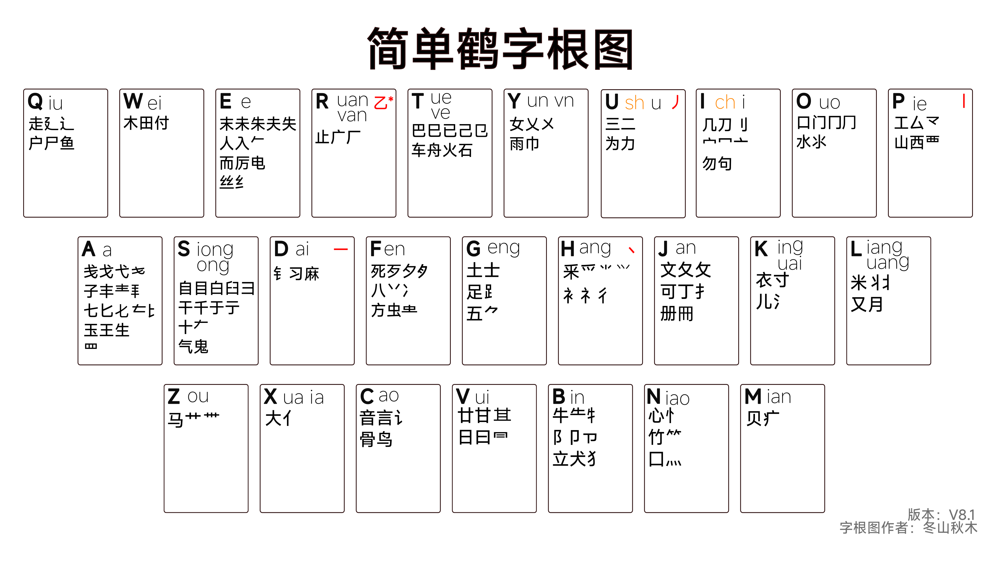

# Rime 输入法 「简单鹤」双拼辅助码方案
Rime 输入法配置方案，小鹤双拼+**简单鹤**乱序字根辅助方案+修改配置后的**全拼（可加辅码）**与 **虎码（字词合并）**方案

---

## 简单鹤介绍

####  乱序字根

使用字根记忆程序学习字根，最快能在一个小时内掌握简单鹤的字根

#### 单字低重

让你轻松盲打

#### 字词不重

简单鹤采用了极端的字词避重方式，在算码的时候尽量让更多的字处在三码位，剩下的四码单字则全部放在次选，好让四码首选永远可以畅快打词。

#### 没有小字

没有小字，拆分直观，使得简单鹤在打生字时也能快速反应

---

本人自用的 简单鹤 rime配置  （暂时仅为已基本掌握简单鹤用户使用）

简单鹤码表与**方案作者 「简单」** 同步更新 （其中不同处为 3码3字词为本人手动维护， 3字词候选优先为那类连词如 「的样子」「非常的」。 3字名词类，作者建议 六码秒了，不要赌词）

ctrl+~切换方案 (简单鹤用户请在开关中开启 「固词」，体验最完全体的简单鹤)

**简单鹤**（虽然文件名是朴素的 double_pinyin_flypy，但实际上补丁中已让其大变样）

**简单鹤・字词**（四码定长，自动上屏）

**朙月拼音・全拼**（虽然文件名是朴素的 luna_pinyin，但实际上补丁中已让其大变样，词库也改为使用白霜拼音。因为小狼毫在「用户配置文件为空」时每次部署都会生成「luna_pinyin.userdb」，本人不想手动删除，索性自用方案也改为 「luna_pinyin」）

**虎码** （虽然文件名是朴素的 tiger，但实际上补丁中已让其大变样。本人在使用简单鹤前，为虎码用户，该方案是单字+词组，两库融合，纯单用户可用开关控制其为纯单 ）

功能介绍等待更新……

简单鹤作者信息等待更新……

感谢说明等待更新……

简单鹤交流群：819641961

